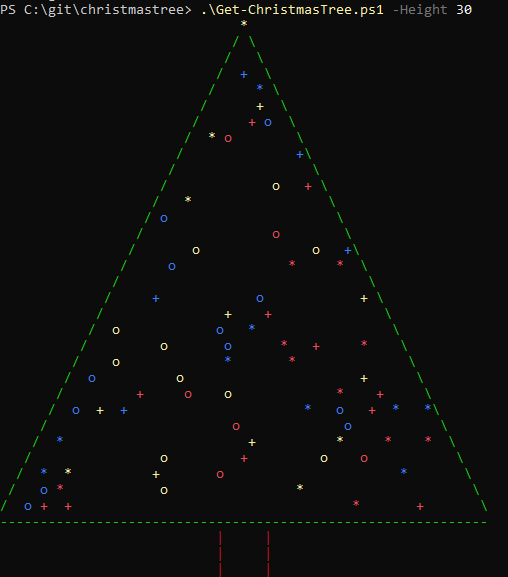
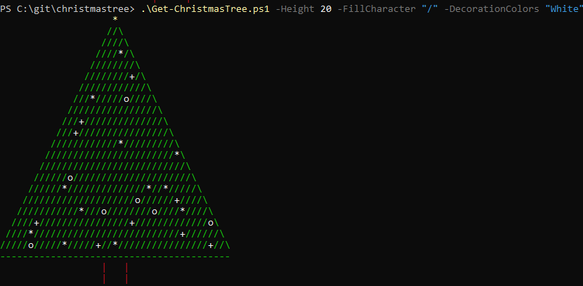
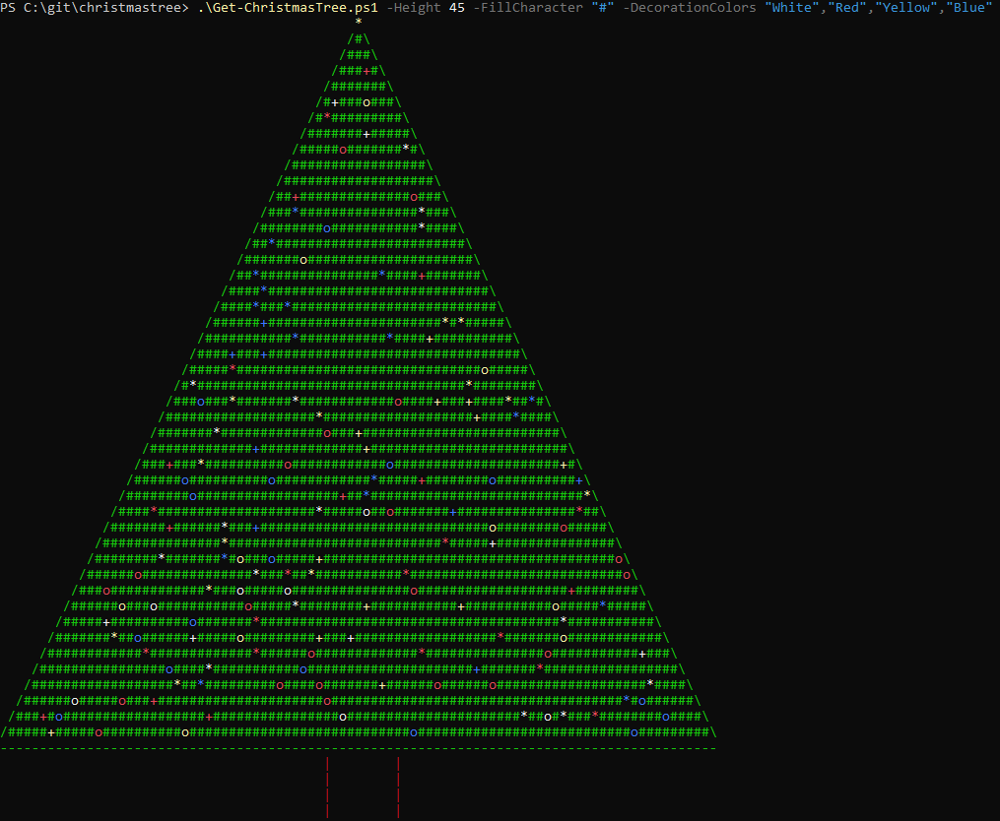

# PowerShell Christmas Tree

## Usage example 1

```PowerShell
.\Get-ChristmasTree.ps1 -Height 30
```



## Usage example 2

```PowerShell
.\Get-ChristmasTree.ps1 -Height 20 -FillCharacter "/" -DecorationColors "White"
```



## Usage example 3

```PowerShell
.\Get-ChristmasTree.ps1 -Height 45 -FillCharacter "#" -DecorationColors "White","Red","Yellow","Blue"
```



## Usage example 4

```PowerShell
.\Get-ChristmasTree.ps1 -Height 10 -LeftPadding 40
```

